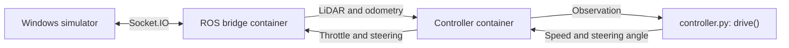

# AutoDRIVE programming workshop

A standalone Windows or macOS workshop: run the practice simulator and implement a Python
driving algorithm. Nothing imports the parent project. To distribute it, copy
this folder **excluding `.runtime/` and `__pycache__/`**. Simulator downloads and
machine-specific session paths stay in `.runtime/` and must not be shared.

This teaching version uses a plain Python controller instead of AVLite plugin
classes. It reuses the main project's AutoDRIVE connection and command-expiry
guard, while leaving the racing planner, research logs and hardware plans out.

## Start

**macOS users:** `workshop.ps1` is Windows-only; follow [Start on macOS](#start-on-macos) instead.

Install Docker Desktop with Linux containers and use Windows PowerShell 5.1 or
newer. A Python editor is useful; installing ROS, Python or AVLite on Windows is
not required. The first start needs Internet access to download the official
simulator and API image, so prepare workshop computers before the session.

Open PowerShell in **this folder**:

```powershell
.\workshop.ps1 start
```

If Windows blocks the script, allow it for this terminal session and retry:

```powershell
Set-ExecutionPolicy -Scope Process -ExecutionPolicy Bypass
```

In the simulator select **Connection** (`127.0.0.1:4567`) and **Autonomous**.
The starter deliberately stays stopped. Implement [controller.py](controller.py),
save it, then reload:

```powershell
.\workshop.ps1 restart -Controller starter
```

To try the supplied example, pause, reset the car in the simulator, then run:

```powershell
.\workshop.ps1 pause
# Reset the car in the simulator before continuing.
.\workshop.ps1 restart -Controller example
```

The example demonstrates gap selection; it is not a verified clean-lap solution.
The selected controller is remembered across restarts. Use `-Controller starter`
to return to your own code.

| Command | Purpose |
| --- | --- |
| `.\workshop.ps1 pause` | Stop sending driving commands; keep Unity and the bridge open |
| `.\workshop.ps1 restart` | Reload saved Python changes and resume the selected controller |
| `.\workshop.ps1 logs -Follow` | See controller errors and connection messages |
| `.\workshop.ps1 status` | Show container state |
| `.\workshop.ps1 test` | Run supplied Python checks in a container without driving |
| `.\workshop.ps1 stop` | Close the workshop simulator and remove its containers; keep downloads |

If you already have the official practice simulator, avoid another download:

```powershell
.\workshop.ps1 start -SimulatorPath 'C:\path\AutoDRIVE Simulator.exe'
```

Only one simulator bridge can own port 4567. Stop the main project before the
workshop; the launcher will not shut it down for you. Docker and a separate ROS
domain keep the workshop's services apart from the main project's controllers.

## Start on macOS

Use `workshop.sh` instead of `workshop.ps1`; it has the same actions. You need
Docker Desktop for Mac and Internet access for the first start (it downloads the
~107 MB macOS simulator and the API image). Python is not required on the Mac.

**Apple Silicon (M1 or later):** the API image is `amd64` only and runs under
emulation. In Docker Desktop, enable **Settings > General > Use Rosetta for
x86_64/amd64 emulation on Apple Silicon**. The first pull is slower than on
Intel or Windows.

Open Terminal in **this folder**:

```bash
./workshop.sh start
```

If macOS blocks the app, right-click `AutoDRIVE Simulator.app` in
`.runtime/practice/autodrive_simulator/`, choose **Open**, and confirm once.
In the simulator select **Connection** (`127.0.0.1:4567`) and **Autonomous**,
then implement [controller.py](controller.py), save it, and reload:

```bash
./workshop.sh restart -c starter
```

To try the supplied example, pause, reset the car in the simulator, then run:

```bash
./workshop.sh pause
# Reset the car in the simulator before continuing.
./workshop.sh restart -c example
```

| Command | Purpose |
| --- | --- |
| `./workshop.sh pause` | Stop sending driving commands; keep the simulator and bridge open |
| `./workshop.sh restart` | Reload saved Python changes and resume the selected controller |
| `./workshop.sh logs -f` | See controller errors and connection messages (omit `-f` for the last lines) |
| `./workshop.sh status` | Show container state |
| `./workshop.sh test` | Run supplied Python checks in a container without driving |
| `./workshop.sh stop` | Close the workshop simulator and remove its containers; keep downloads |

`-c` is short for `--controller`. Use `start -s '/path/AutoDRIVE Simulator.app'`
to reuse an existing simulator instead of downloading one. If Docker Desktop is
not running, the script opens it. The commands in the rest of this README use
the Windows `.\workshop.ps1` form; substitute `./workshop.sh` and `-c`.

> **Status:** verified on Apple Silicon (macOS, Docker Desktop with Rosetta):
> `start`, `restart`, `pause`, `stop`, `status`, `logs` and `test` run, and the
> simulator launches and listens on port 4567. A full lap has not been driven.

## Participant code

Implement one function:

```python
from workshop_api import DriveCommand, Observation

def drive(observation: Observation) -> DriveCommand:
    # Your sensor processing, steering and speed decisions go here.
    return DriveCommand(speed_mps=0.0, steering_rad=0.0)
```

| Input / output | Meaning |
| --- | --- |
| `observation.ranges` | LiDAR distances in metres; zero is invalid/unknown, maximum range means clear to the sensor limit |
| `angle_min`, `angle_increment` | Ray angle: `angle_min + i * angle_increment`, in radians |
| `observation.sector(low, high)` | Rays between two angles in `[-pi, pi]`; zero points ahead, positive angles point left |
| `speed_mps`, `x`, `y`, `yaw` | Measured forward speed and simulator world pose; metres, seconds and radians |
| `observation.dt` | Seconds since the previous control tick |
| `DriveCommand.speed_mps` | Requested forward speed, capped at 1 m/s by the runtime |
| `DriveCommand.steering_rad` | Front wheel angle, capped at +/-30 degrees; positive turns left |

The runtime targets 20 calls/second. Return promptly; do not start your own loop
or sleep in `drive()`. Return `DriveCommand()` when you cannot choose a valid
command. Exceptions, invalid outputs and calls exceeding 0.1 seconds stop the
controller until you fix the code and restart it.

For a chosen target bearing `alpha` and lookahead distance `L`, a useful starting
point for steering is Pure Pursuit:

$$
\delta=\arctan\left(\frac{2b\sin\alpha}{L}\right),\qquad b=0.324\ \mathrm{m}.
$$

Here `b` is wheelbase and `delta` is the steering angle. The
[example](examples/follow_the_gap.py) selects a free gap, aims at its middle and
reduces speed as steering increases. Use it as a reference after trying your own
solution. Requested speed is converted to normalized simulator throttle by
[runtime/core.py](runtime/core.py); speed and throttle have different units.

## Workshop exercises

- [ ] Start the simulator and confirm fresh sensor messages in the logs.
- [ ] Keep the car stopped when the forward sector is blocked or unknown.
- [ ] Implement steering using wall following or Follow the Gap.
- [ ] Slow down for corners and nearby obstacles.
- [ ] Complete one clean lap, then repeat three times with the same settings.
- [ ] Compare lap times using the simulator's lap/collision counters.

Record controller settings, completed laps and collisions when comparing changes.
This starter includes neither the main project's lap recorder nor its plotting
pipeline; those can be a later workshop exercise.

## How the supplied runtime works



| File | Role |
| --- | --- |
| [controller.py](controller.py) | Participant's algorithm; initially stopped |
| [workshop_api.py](workshop_api.py) | Small sensor/command interface, usable without ROS |
| [examples/follow_the_gap.py](examples/follow_the_gap.py) | Optional teaching example |
| [runtime/node.py](runtime/node.py) | Sensor validation, ROS subscriptions and control loop |
| [runtime/core.py](runtime/core.py) | Scan conversion, bounds and simulator speed feedback |
| [runtime/bridge.py](runtime/bridge.py) | AutoDRIVE startup handshake and final command expiry |
| [compose.yaml](compose.yaml) | Isolated workshop services and live source mounts |
| [workshop.ps1](workshop.ps1) | Download, start, reload, pause and stop |

Sensor checks use both source timestamps and monotonic receive times. Commands
expire at the bridge after 0.5 seconds without updates, including when participant
code hangs or its process dies. A close/unknown forward sector removes throttle;
this does not provide full collision avoidance. Zero throttle does not guarantee
an instantaneous stop. This runtime and its calibration are for simulation.

## Troubleshooting and instructor checks

- **Car stays stopped:** the default starter returns zero. Implement it or select
  the example; check Connection, Autonomous and `.\workshop.ps1 logs`.
- **Changes have no effect:** save the file and restart with `-Controller starter`.
  Source files are mounted directly; no image rebuild is needed.
- **Port 4567 is busy:** stop the other project and close its Unity window first.
- **Download/image pull fails:** check Docker Desktop and network access. No
  simulator binary is shipped in this folder.
- **Controller fault:** fix the error shown in logs, then restart. A hang may need
  the launcher's three-second container stop timeout before reloading.

For checks without Docker, install Python 3.10+ and run from this folder:

```powershell
python -B -m unittest discover -s tests -v
powershell -NoProfile -ExecutionPolicy Bypass -File tests/test-launcher.ps1
```

Before teaching, run `start`, select the example and verify steering and simulator
counters on each computer. Then pause, reset the car and run
`.\workshop.ps1 restart -Controller starter`. Automated checks do not prove the
example completes a clean lap.

Validation on 3 October 2026: Python checks, mocked Windows launcher checks,
isolated ROS sensor/fault checks, and a live Windows simulator connection passed.
The stopped starter received live odometry and published zero throttle/steering;
measured speed remained zero. The example has not been validated for clean laps.

The simulator and ROS API come from the
[official AutoDRIVE ICRA 2026 release](https://github.com/AutoDRIVE-Ecosystem/AutoDRIVE-RoboRacer-Sim-Racing/releases/tag/2026-icra).
They are downloaded separately and retain their upstream licenses.
